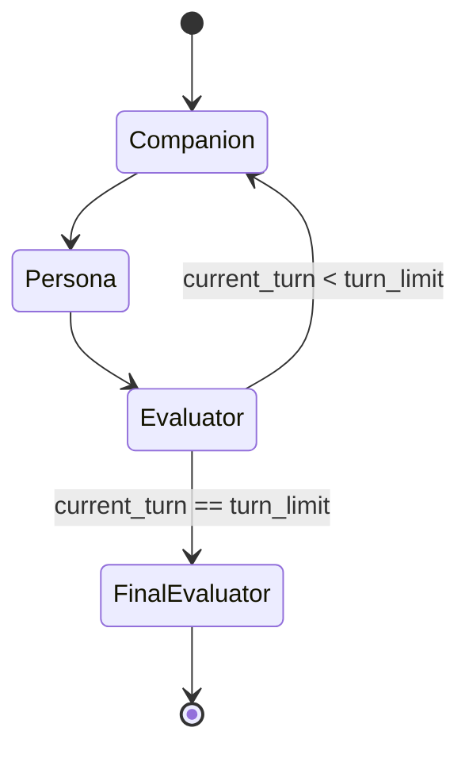

### 폴더 구조
```
companion-evaluator
├── report/             # 모델별 대화턴별 대화 데이터
├── src/
│   ├── agent/          # 에이전트 구현
│   ├── factory/        # 모델 팩토리
│   ├── interface/      # 인터페이스 정의
│   ├── prompt/         # 프롬프트 템플릿
│   └── main.py         # 메인 실행 파일
└── asset/             # 리소스 파일
    └── template/prompt     # jinja 템플릿
    └── character/     # yaml 형식으로 캐릭터 설정 파일
```

### langgraph


### 용어
- persona: 사용자
- companion: 사용자가 대화하고자 하는 상대
- evaluator: 대화 품질 평가기
- model: LLM과 같은 인공 지능 모델
- character: 성격, 성장 과정 등 사람의 속성
- agent: model 을 래핑한 것으로 persona, agent, evaluator 모두 agent

